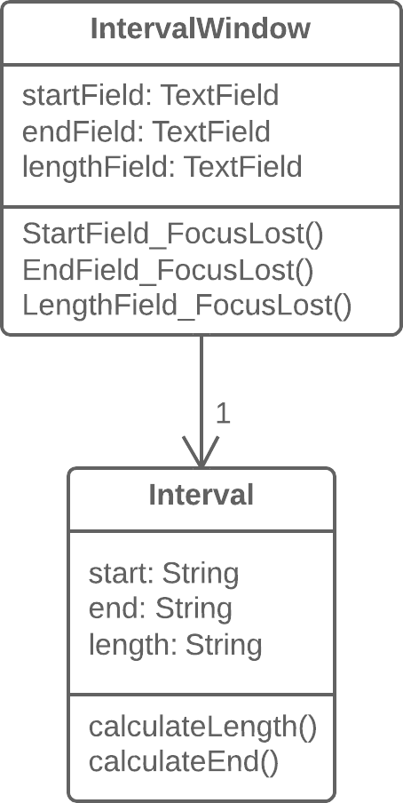

**Также известен как:** Duplicate Observed Data

### Проблема
Данные предметной области программы хранятся в классах, отвечающих за пользовательский интерфейс (GUI).

### Решение
Имеет смысл выделить данные предметной области в отдельные классы и, таким образом, обеспечить связь и синхронизацию между классом предметной области и GUI.

### Причины рефакторинга
Вы хотите иметь несколько видов интерфейса для одних и тех же данных (например, у вас есть приложение не только для десктопа, но также для телефонов и планшетов). В этом случае вам будет очень сложно избежать большого количества ошибок и дублирования кода, если вы не разделите GUI и предметную область.

### Достоинства
- Вы разделяете ответственность между классами бизнес-логики и представления (_принцип единственной обязанности_), что упрощает читабельность и понимание программы в целом.
    
- Если потребуется добавить новый вид интерфейса, вам нужно будет создать новые классы представления, при этом код бизнес-логики трогать нет никакой нужды (_принцип открытости/закрытости_).
    
- Над бизнес-логикой и пользовательскими интерфейсами теперь могут работать разные люди.
    

### Когда нельзя применить
- Этот рефакторинг, который в классическом исполнении производится с введением паттерна [Наблюдатель](https://refactoring.guru/ru/design-patterns/observer), малоприменим для веб-приложений, где все классы пересоздаются между запросами к веб-серверу.
    
- Тем не менее, общий принцип извлечения бизнес-логики в отдельные классы имеет смысл, в том числе, и для веб-приложений. Но реализуется он при помощи других рефакторингов, исходя из дизайна вашей системы.
    

### Порядок рефакторинга
1. Необходимо скрыть прямой доступ к данным предметной области в _классе GUI_, для чего лучше всего использовать [самоинкапсуляцию поля](https://refactoring.guru/ru/self-encapsulate-field). Таким образом, вы создадите геттеры и сеттеры к этим данным.
    
2. В обработчиках событий _класса GUI_ используйте сеттеры для установки новых значений полей. Это даст возможность передавать новые значения в связанный _объект предметной области_.
    
3. Создайте класс предметной области и скопируйте в него необходимые поля из _класса GUI_. Для всех этих полей создайте геттеры и сеттеры.
    
4. Примените паттерн Наблюдатель к этим двум классам:
    
    - В _классе предметной области_ создайте массив для хранения объектов наблюдателей (_объектов GUI_), а также методы их регистрации, удаления и оповещения.
        
    - В _классе GUI_ создайте поле для хранения ссылки на _объект предметной области_, а также метод `update()`, который будет реагировать на изменения в этом объекте и обновлять значения полей в _классе GUI_. Обратите внимание, в методе обновления значения должны устанавливаться напрямую, чтобы избежать рекурсии.
        
    - В конструкторе _класса GUI_ создайте экземпляр _класса предметной области_ и сохраните его в созданном поле. Зарегистрируйте _объект GUI_ как наблюдатель в _объекте предметной области_.
        
    - В сеттерах полей _класса предметной области_ вызывайте метод оповещения наблюдателя (т.е. метод обновления в _классе GUI_), чтобы передать новые значения в пользовательский интерфейс.
        
    - Измените сеттеры полей _класса GUI_ так, чтобы они теперь устанавливали новые значения в объекте предметной области, причём напрямую. Будьте внимательны, если значения будут устанавливаться через сеттер _класса предметной области_, это приведёт к бесконечной рекурсии.

### Реализует паттерн проектирования
[Наблюдатель](https://refactoring.guru/ru/design-patterns/observer)

### Борется с запахом
[Большой класс](https://refactoring.guru/ru/smells/large-class)
