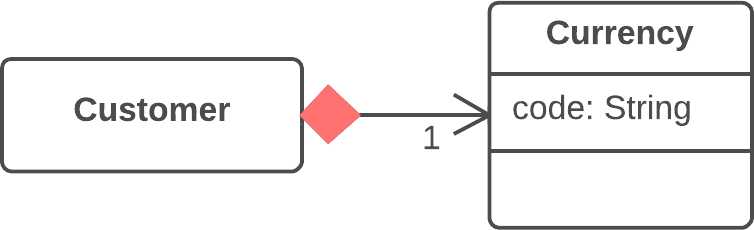

**Также известен как:** Change Reference to Value

### Проблема
У вас есть объект-ссылка, который слишком маленький и неизменяемый, чтобы оправдать сложности по управлению его жизненным циклом.

### Решение
Превратите его в объект-значение.

### Причины рефакторинга
Побудить к переходу от ссылки к значению могут возникшие при работе с объектом-ссылкой неудобства.

Объектами-ссылками необходимо некоторым образом управлять:

- всегда приходится запрашивать у объекта-хранилища нужный объект;
    
- ссылки в памяти тоже могут оказаться неудобными в работе;
    
- работать с объектами-ссылками, в отличие от объектов-значений, особенно сложно в распределённых и параллельных системах.
    

Кроме того, объекты-значения будут особенно полезны, если вам больше подходит неизменяемость объектов, чем возможность изменения их состояния во время жизни объекта.

### Достоинства
- Важное свойство объектов-значений заключается в том, что они должны быть неизменяемыми. При каждом запросе, возвращающем значение одного из них, должен получаться одинаковый результат. Если это так, то не возникает проблем при наличии многих объектов, представляющих одну и ту же вещь.
    
- Объекты-значения гораздо проще в реализации.
    

### Недостатки
Если значение изменяемое, вам необходимо обеспечить, чтобы при изменении любого из объектов обновлялись значения во всех остальных, которые представляют ту же самую сущность. Это настолько обременительно, что проще для этого создать объект-ссылку.

### Порядок рефакторинга
1. Обеспечьте неизменяемость объекта. Объект не должен иметь сеттеров или других методов, меняющих его состояние и данные (в этом может помочь [удаление сеттера](https://refactoring.guru/ru/remove-setting-method)). Единственное место, где полям объекта-значения присваиваются какие-то данные, должен быть конструктор.
    
2. Создайте метод сравнения для того, чтобы иметь возможность сравнить два объекта-значения.
    
3. Проверьте, возможно ли удалить фабричный метод и сделать конструктор объекта публичным.

### Анти-рефакторинг
[Замена значения ссылкой](https://refactoring.guru/ru/change-value-to-reference)
