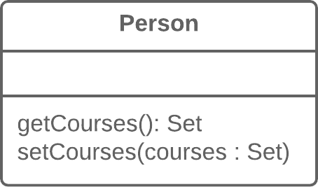
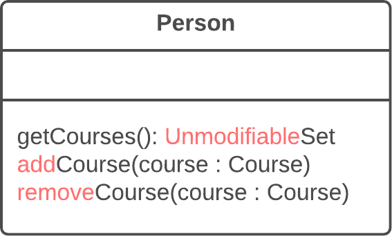

**Также известен как:** Encapsulate Collection

### Проблема
Класс содержит поле-коллекцию и простой геттер и сеттер для работы с этой коллекцией.

### Решение
Сделайте возвращаемое геттером значение доступным только для чтения и создайте методы добавления/удаления элементов этой коллекции.

### Причины рефакторинга
В классе есть поле, содержащее коллекцию объектов. Эта коллекция может быть массивом, списком, множеством или вектором. Для работы с этой коллекцией создан обычный геттер и сеттер.

Однако коллекции должны использовать протокол, несколько отличный от того, который используется другими типами данных. Метод получения не должен возвращать сам объект коллекции, потому что это позволило бы клиентам изменять содержимое коллекции без ведома владеющего ею класса. Кроме того, это чрезмерно раскрывало бы клиентам строение внутренних структур данных объекта. Метод получения элементов коллекции должен возвращать такое значение, которое не позволяло бы изменять коллекцию и не раскрывало бы лишних данных о её структуре.

Кроме того, не должно быть метода, присваивающего коллекции значение; вместо этого должны быть операции для добавления и удаления элементов. Благодаря этому объект-владелец получает контроль над добавлением и удалением элементов коллекции.

Такой протокол осуществляет корректную инкапсуляцию коллекции, что, в итоге, уменьшает связанность между владеющим ею классом и клиентским кодом.

### Достоинства
- Поле коллекции инкапсулировано внутри класса. При вызове геттера возвращается копия коллекции, что исключает возможность случайного изменения или перетирания элементов коллекции, без ведома того объекта, в котором она хранится.
    
- В случае если элементы коллекции содержатся внутри примитивного типа, вроде массива, вы создаёте более удобные методы работы с коллекцией.
    
- Если элементы коллекции содержатся внутри непримитивного контейнера (стандартного класса коллекций), инкапсулировав коллекцию, вы можете ограничить доступ к нежелательным стандартным методам коллекции (например, ограничив добавление новых элементов).
    

### Порядок рефакторинга
1. Создайте методы для добавления и удаления элементов коллекции. Они должны принимать элементы коллекции в параметрах.
    
2. Присвойте полю пустую коллекцию в качестве начального значения, если это ещё не делается в конструкторе класса.
    
3. Найдите вызовы сеттера поля коллекции. Измените сеттер так, чтобы он использовал операции добавления и удаления элементов, или сделайте так, чтобы эти операции вызывал клиентский код.
    
    Обратите внимание, что сеттеры могут быть использованы только для того, чтобы заменить все элементы коллекции на другие. Исходя из этого, возможно, имеет смысл [изменить название сеттера](https://refactoring.guru/ru/rename-method) на `replace`.
    
4. Найдите все вызовы геттера коллекции, после которых происходит изменение коллекции. Поменяйте этот код так, чтобы там использовались ваши новые методы добавления и удаления элементов коллекции.
    
5. Измените геттер, чтобы он возвращал представление коллекции, доступное только для чтения.
    
6. Обследуйте клиентский код, использующий коллекцию, в поисках кода, который бы лучше смотрелся внутри самого класса коллекции.

### Борется с запахом
[Класс данных](https://refactoring.guru/ru/smells/data-class)
